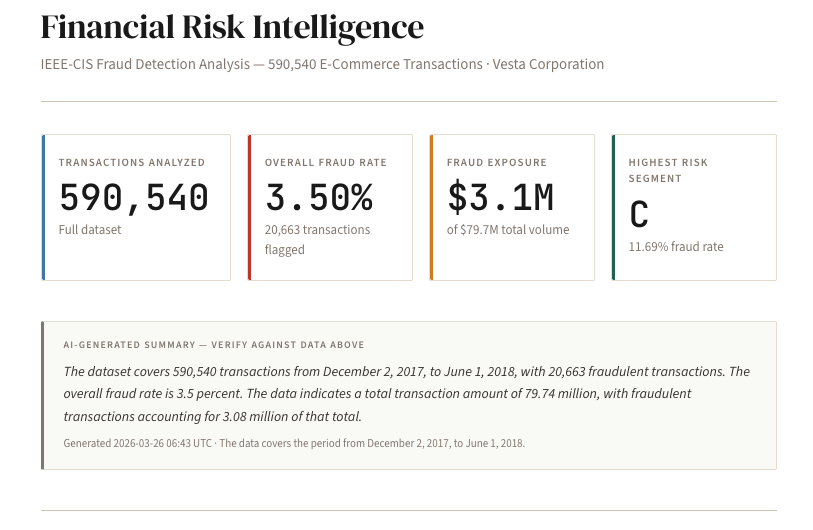

# Intelligent Financial Risk Control System

> End-to-end data engineering pipeline for real-time and batch fraud detection analytics — built for the [DataTalksClub Data Engineering Zoomcamp](https://github.com/DataTalksClub/data-engineering-zoomcamp).


**[Live Dashboard →](https://rayluo88.github.io/zoomcamp-dataeng-proj/)**



---

## Table of Contents

1. [Problem Description](#1-problem-description)
2. [Architecture](#2-architecture)
3. [Technology Stack & Justifications](#3-technology-stack--justifications)
4. [Project Structure](#4-project-structure)
5. [Data Pipeline](#5-data-pipeline)
6. [Setup & Reproduction](#6-setup--reproduction)
7. [Evaluation Criteria](#7-evaluation-criteria)
8. [Dashboard & Agentic AI](#8-dashboard--agentic-ai)
9. [Acknowledgements](#9-acknowledgements)

---

## 1. Problem Description

### The Problem

Card fraud costs the global economy over **$32 billion per year**. For e-commerce merchants and payment processors, distinguishing fraudulent transactions from legitimate ones in near-real-time is a critical operational challenge. Traditional rule-based systems miss sophisticated fraud patterns; data-driven approaches require robust analytical infrastructure.

### This Project

This system ingests, processes, and visualises **590,540 real-world e-commerce transactions** from Vesta Corporation's production payment system (anonymised, via the [IEEE-CIS Fraud Detection dataset](https://www.kaggle.com/competitions/ieee-fraud-detection)). It answers:

- **What is the fraud rate by product type, card type, and device?**
- **How does fraud vary over time?** (temporal trend analysis)
- **Which transaction segments carry the highest risk?**
- **Can a streaming pipeline detect anomalies in near-real-time?**

### Dataset

| Attribute | Detail |
|---|---|
| Source | Vesta Corporation (real production data, anonymised) |
| Size | 590,540 transactions + 144,233 identity records |
| Fraud rate | 3.5% (20,663 flagged transactions) |
| Features | 400+ (transaction amount, card type, email domains, device info, match flags) |
| Time span | ~6 months of e-commerce activity |
| Kaggle page | [ieee-fraud-detection](https://www.kaggle.com/competitions/ieee-fraud-detection) |

---

## 2. Architecture

```
┌─────────────────────────────────────────────────────────────────────────────┐
│                         BATCH PIPELINE                                       │
│                                                                              │
│  Kaggle API                                                                  │
│      │                                                                       │
│      ▼                                                                       │
│  CSV files  ──► Parquet conversion ──► GCS (raw/ieee_cis/)                  │
│                                             │                                │
│                                             ▼                                │
│                                    BigQuery raw dataset                      │
│                                    (external tables)                         │
│                                             │                                │
│                                             ▼                                │
│                                    BigQuery staging                          │
│                                    (dbt views: stg_*)                       │
│                                             │                                │
│                                             ▼                                │
│                                    BigQuery production                       │
│                                    (dbt tables: fct_*, mart_*)               │
│                                             │                                │
│                                             ▼                                │
│                                    LLM Narration Layer                       │
│                                    (generate_narration.py)                   │
│                                    DeepSeek / any OpenAI-compatible API      │
│                                    → dashboard/sources/narration/            │
│                                             │                                │
│                                             ▼                                │
│                                    Evidence.dev Dashboard                    │
│                                                                              │
└─────────────────────────────────────────────────────────────────────────────┘

┌─────────────────────────────────────────────────────────────────────────────┐
│                         STREAMING PIPELINE                                   │
│                                                                              │
│  CSV replay                                                                  │
│  (producer.py)  ──► Redpanda topic ──► Consumer (consumer.py)               │
│                     ieee_cis_            │                                   │
│                     transactions         ├──► GCS raw/stream/YYYY/MM/DD/    │
│                                          └──► BigQuery raw.stream_txns       │
│                                                                              │
└─────────────────────────────────────────────────────────────────────────────┘

┌─────────────────────────────────────────────────────────────────────────────┐
│                         ORCHESTRATION                                        │
│                                                                              │
│  Apache Airflow (Docker)                                                     │
│  DAG: risk_batch_ingest                                                      │
│    download_dataset                                                          │
│         │                                                                    │
│         ▼                                                                    │
│    convert_to_parquet                                                        │
│         │                                                                    │
│         ▼                                                                    │
│    upload_to_gcs                                                             │
│         │                                                                    │
│         ▼                                                                    │
│    create_bq_tables                                                          │
│                                                                              │
└─────────────────────────────────────────────────────────────────────────────┘

┌─────────────────────────────────────────────────────────────────────────────┐
│                         INFRASTRUCTURE (Terraform → GCP)                    │
│                                                                              │
│  google_storage_bucket          financial-risk-control-system-datalake      │
│  google_bigquery_dataset        raw / staging / production                  │
│  google_service_account         risk-pipeline (Airflow, dbt, scripts)       │
│  google_project_iam_member      storage.objectAdmin, bigquery.dataEditor    │
│  google_service_account_key     → credentials/pipeline-sa-key.json         │
│                                                                              │
└─────────────────────────────────────────────────────────────────────────────┘
```

---

## 3. Technology Stack & Justifications

### Cloud: Google Cloud Platform

| Service | Role |
|---|---|
| **BigQuery** | Data warehouse — serverless MPP, native partitioning/clustering, SQL analytics at scale |
| **GCS** | Data lake — object storage for raw CSVs, Parquet files, and streaming output |
| **IAM** | Access control — service account with scoped permissions (principle of least privilege) |

**Why GCP**: BigQuery is the industry leader for cloud-native analytical SQL. Its serverless model eliminates cluster management, and its native integration with GCS makes the GCS → BigQuery pipeline frictionless. The `asia-southeast1` (Singapore) region minimises latency for Southeast Asian use cases and avoids cross-region data transfer costs.

---

### Infrastructure as Code: Terraform

**Why Terraform**: Industry standard for cloud IaC. Declarative configuration, state management (stored in GCS backend), and reproducibility — any reviewer can clone this repo and `terraform apply` to recreate the entire infrastructure from scratch. All 10 GCP resources (bucket, 3 BigQuery datasets, service account, 3 IAM bindings, SA key, local key file) are defined in `terraform/main.tf`.

---

### Orchestration: Apache Airflow 2.11.2

**Why Airflow**: The most widely-adopted workflow orchestrator in data engineering. DAG-based task dependency management, built-in retry logic, and a web UI for monitoring.

**Why 2.11.2 (not 3.x)**: Airflow 3.0 introduced breaking changes in the TaskFlow API, provider packages, and scheduler architecture that are incompatible with the DataTalksClub course material. 2.11.2 is the latest stable 2.x release with full ecosystem support.

**Deployment**: Docker Compose with `LocalExecutor` + PostgreSQL 17 metadata database. No external executor needed for a single-machine setup; matches what's expected in the course.

---

### Streaming: Redpanda

**Why streaming at all?**

In production fraud detection, every millisecond matters. Transactions flow continuously from payment terminals, mobile apps, and e-commerce checkouts — not in daily batches. A batch pipeline that runs once a day would miss fraud happening *right now*. The real-world architecture is:

1. A payment transaction is authorised → an event is published to an **event store** (Kafka/Redpanda topic)
2. A **stream processor** consumes the event in near-real-time and runs fraud scoring
3. The decision (approve / flag / decline) is returned before the merchant's timeout (~2–3 seconds)

This project mirrors that architecture: `producer.py` replays IEEE-CIS transactions onto a Redpanda topic, and `consumer.py` streams them into the data lake and warehouse — the same pattern used in production Kafka-based fraud pipelines. The batch pipeline handles historical analysis; the streaming pipeline handles the live transaction flow.

**Why Redpanda over Apache Kafka?**

| Factor | Kafka | Redpanda |
|---|---|---|
| Runtime | JVM (Java/Scala) | Native C++ binary |
| Latency | ~5–10 ms | ~1 ms (10x faster) |
| Operations | ZooKeeper / KRaft + Kafka broker | Single binary, no dependencies |
| Memory | High (JVM heap) | Low (no GC pauses) |
| API compatibility | Kafka native | 100% Kafka API compatible |
| Dev experience | Multiple processes to manage | `docker compose up` — done |

**For this project**: Redpanda drops the JVM entirely, runs as a single C++ binary, and exposes the exact same Kafka API. This means all standard Kafka client libraries (including `kafka-python`) work without modification. On a development machine, Redpanda uses a fraction of Kafka's memory and starts in seconds. It is the fastest-growing Kafka-compatible platform by GitHub stars and enterprise adoption.

**What we learn**: Because Redpanda is 100% Kafka API compatible, all concepts transfer directly — topics, partitions, consumer groups, offsets, producers, consumers. The knowledge is portable to Kafka in production.

---

### Data Warehouse Design: BigQuery

**Medallion architecture** (3-layer):

```
raw (external tables on GCS Parquet)
  └── staging (dbt views — type casting + renaming)
        └── production (dbt tables — partitioned + clustered)
```

**Partitioning**: `fct_transactions` is partitioned by `transaction_date` (daily). Queries filtering by date range (e.g., "show me fraud in the last 30 days") skip irrelevant partitions entirely.

**Clustering**: Clustered by `product_cd`, `card_type`, `is_fraud`. Queries filtering on these columns (the most common dashboard filters) are dramatically faster on BigQuery's columnar storage.

---

### Transformations: dbt

**Why dbt**: SQL-first transformations with version control, testing, and documentation. Industry standard for the "T" in ELT.

**Model layers**:
- `stg_transactions`, `stg_identity` — staging views: type-safe column renames, no business logic
- `fct_transactions` — fact table: JOIN of transaction + identity data, derived fields (`email_domain_type`, `amount_bucket`)
- `mart_risk_summary` — pre-aggregated: UNION ALL of daily/product/card/device summaries, powers the entire dashboard without query-time aggregation

**Data quality**: 4 dbt tests defined in `sources.yml` (unique + not_null on `TransactionID`, not_null on `isFraud`). All tests pass.

**Custom macro**: `generate_schema_name.sql` overrides dbt's default schema-stacking behaviour (which would create `staging_staging` instead of `staging`), keeping BigQuery dataset names clean.

---

### Dashboard: Evidence.dev

**Why Evidence.dev over Streamlit?**

| Factor | Streamlit | Evidence.dev |
|---|---|---|
| Aesthetics | Generic "AI app" look | Editorial, professional |
| Architecture | Python server (always running) | Compiles to static HTML |
| Hosting | Needs a server | Free on Vercel/Netlify |
| Data access | Python code | SQL directly in Markdown |
| BigQuery | Manual via `google-cloud-bigquery` | Native connector |
| Learning curve | Python | SQL + Markdown |

**Why Evidence.dev over Looker Studio?**

Looker Studio is powerful but has limited design control and requires a Google account to create/edit dashboards. Evidence.dev compiles to a fully customisable static site, version-controlled in git, deployable anywhere.

**Design**: "Broadsheet Analytical" aesthetic — Financial Times editorial style. Warm ivory background (`#FDF8F0`), DM Serif Display headings, JetBrains Mono data values, Economist red (`#C23D2E`) for fraud metrics. See [`dashboard/DESIGN.md`](dashboard/DESIGN.md) for the full design specification.

---

### Agentic AI: LLM Narration Layer

This project goes beyond static analytics by adding a **provider-agnostic LLM narration layer** that generates natural-language summaries of fraud patterns at build time.

**Architecture principle**: the LLM narrates verified facts — it has **no role in fraud detection**. Risk scores come entirely from dbt/BigQuery; the LLM only translates aggregated numbers into readable prose.

```
mart_risk_summary (BigQuery)  ─►  generate_narration.py  ─►  DeepSeek API
                                          │
                                          ▼
                              dashboard/sources/narration/summary.csv
                                          │
                                          ▼
                              Evidence.dev renders AI blocks
                              (labeled "AI-Generated — verify against charts above")
```

**Provider-agnostic design** — swap LLM providers by changing three environment variables:

| Provider | `LLM_BASE_URL` | `LLM_MODEL` |
|---|---|---|
| **DeepSeek** (default) | `https://api.deepseek.com` | `deepseek-chat` |
| OpenAI | `https://api.openai.com/v1` | `gpt-4o-mini` |
| Groq (free) | `https://api.groq.com/openai/v1` | `llama-3.3-70b-versatile` |
| Ollama (local) | `http://localhost:11434/v1` | `llama3.2` |

Uses the `openai` Python SDK — one interface, any provider.

**Hallucination guardrails** — three layers ensure LLM output doesn't pollute analytics:

1. **Input constraints**: LLM only receives pre-aggregated JSON (no raw transactions, no PII)
2. **Prompt constraints**: system prompt prohibits fabrication, causation claims, and predictions
3. **Output validation**: JSON parse check, cross-reference numbers against source data, length limits
4. **Graceful degradation**: if narration fails, dashboard renders perfectly without it

```bash
make narrate          # Generate narration from live BigQuery data
make narrate-dry      # Preview prompt without calling API
make narrate-mock     # Write sample output (no BigQuery or API needed)
make dashboard-full   # Narrate + pull sources + build in one step
```

---

### Python Package Management: uv

**Why uv over pip/venv?**

- **10–100x faster** than pip (Rust implementation, parallel downloads)
- **Single tool**: replaces pip + virtualenv + pip-tools in one command
- **Deterministic**: `uv.lock` guarantees identical environments across machines
- **Zero activation**: `uv run <command>` activates the venv automatically
- **Fastest-growing** Python package manager by adoption (2024–2025)

```bash
# Old workflow:
python -m venv .venv && source .venv/bin/activate && pip install -r requirements.txt

# uv workflow:
uv run dbt run   # that's it
```

---

## 4. Project Structure

```
.
├── terraform/                    # Infrastructure as Code
│   ├── main.tf                   # GCS bucket, BigQuery datasets, service account, IAM
│   ├── variables.tf              # Project ID, region, bucket name
│   └── outputs.tf                # Bucket URL, service account email
│
├── airflow/                      # Batch orchestration
│   ├── Dockerfile                # Airflow 2.11.2 + GCP dependencies
│   ├── docker-compose.yaml       # Webserver + scheduler + PostgreSQL 17
│   └── dags/
│       └── risk_batch_ingest.py  # DAG: download → parquet → GCS → BigQuery
│
├── scripts/
│   ├── ingest_to_gcs.py          # Standalone batch ingestion script
│   └── generate_narration.py     # LLM narration: BigQuery → DeepSeek API → CSV
│
├── bigquery/
│   ├── staging_tables.sql        # Staging layer DDL (run once)
│   └── production_tables.sql     # Production table DDL (run once)
│
├── dbt/                          # SQL transformations
│   ├── dbt_project.yml           # Project config: staging views, mart tables
│   ├── macros/
│   │   └── generate_schema_name.sql   # Custom schema naming (avoids stacking)
│   └── models/
│       ├── staging/
│       │   ├── sources.yml            # Source definitions + data quality tests
│       │   ├── stg_transactions.sql   # Typed, renamed transaction columns
│       │   └── stg_identity.sql       # Device/browser/OS columns
│       └── marts/
│           ├── fct_transactions.sql   # Partitioned + clustered fact table
│           └── mart_risk_summary.sql  # Pre-aggregated risk metrics
│
├── redpanda/                     # Streaming pipeline
│   ├── docker-compose.yaml       # Redpanda broker + Console UI
│   ├── console-config.yaml       # Console → broker connection
│   ├── producer.py               # CSV replay → topic ieee_cis_transactions
│   └── consumer.py               # topic → GCS (gzip NDJSON) + BigQuery
│
├── dashboard/                    # Evidence.dev dashboard
│   ├── DESIGN.md                 # Design specification and rationale
│   ├── evidence.config.yaml      # Theme, color palette, plugins
│   ├── sources/bigquery/         # BigQuery SQL queries
│   │   ├── connection.yaml       # Service account key authentication (Vercel-ready)
│   │   ├── risk_summary.sql      # mart_risk_summary query
│   │   └── amount_buckets.sql    # fct_transactions aggregation
│   ├── sources/narration/        # LLM narration source (CSV connector)
│   │   ├── connection.yaml       # Evidence.dev CSV connector config
│   │   └── summary.csv           # Generated by scripts/generate_narration.py
│   ├── pages/
│   │   └── index.md              # Dashboard page: SQL + chart components + AI narration blocks
│   └── vercel.json               # Vercel deployment config
│
├── docs/
│   └── deploy-vercel.md          # Step-by-step Vercel deployment guide
├── pyproject.toml                # Python dependencies (uv)
├── uv.lock                       # Locked dependency versions
├── Makefile                      # One-command operations
├── .env.example                  # Required environment variables
└── CLAUDE.md                     # AI assistant context file
```

---

## 5. Data Pipeline

### BigQuery Layers

| Layer | Dataset | Contents | Materialization |
|---|---|---|---|
| **Raw** | `raw` | External tables on GCS Parquet | External (no data copy) |
| **Staging** | `staging` | Type-cast + renamed columns | dbt views |
| **Production** | `production` | Fact table + aggregated marts | dbt tables (partitioned) |

### dbt Models

| Model | Type | Key Logic |
|---|---|---|
| `stg_transactions` | View | Renames 20+ columns, casts types, normalises strings |
| `stg_identity` | View | Renames device/browser/OS columns |
| `fct_transactions` | Table | LEFT JOIN stg_transactions + stg_identity; adds `email_domain_type`, `amount_bucket` |
| `mart_risk_summary` | Table | UNION ALL of daily/product/card/device aggregates; 195 rows |

### Streaming Topic

| Property | Value |
|---|---|
| Topic | `ieee_cis_transactions` |
| Partitions | 3 |
| Message format | JSON with `transaction_ts` (ISO 8601) |
| Producer throughput | Configurable via `--speed` (default: 3600× time compression) |
| Consumer output | GCS `raw/stream/YYYY/MM/DD/HH/batch_<ts>.json.gz` + BigQuery streaming insert |

---

## 6. Setup & Reproduction

### Prerequisites

| Tool | Version | Install |
|---|---|---|
| `gcloud` CLI | latest | [cloud.google.com/sdk](https://cloud.google.com/sdk/docs/install) |
| Terraform | ≥ 1.5 | [terraform.io](https://developer.hashicorp.com/terraform/install) |
| Docker + Docker Compose | ≥ 24 | [docs.docker.com](https://docs.docker.com/get-docker/) |
| Node.js | ≥ 18 | [nodejs.org](https://nodejs.org/) |
| `uv` | latest | `curl -LsSf https://astral.sh/uv/install.sh \| sh` |

### Step 1 — Clone & Configure

```bash
git clone https://github.com/rayluo88/zoomcamp-dataeng-proj.git
cd zoomcamp-dataeng-proj
cp .env.example .env
# Edit .env with your GCP project ID and Kaggle credentials
```

### Step 2 — GCP Authentication & APIs

```bash
gcloud auth login
gcloud auth application-default login
gcloud config set project financial-risk-control-system

# Enable required APIs
gcloud services enable bigquery.googleapis.com \
    storage.googleapis.com \
    iam.googleapis.com \
    cloudresourcemanager.googleapis.com
```

### Step 3 — Provision Infrastructure (Terraform)

```bash
make infra
# Creates: GCS bucket, 3 BigQuery datasets, service account, IAM bindings, SA key
# Output: credentials/pipeline-sa-key.json (auto-written)
```

### Step 4 — Install Python Dependencies

```bash
make setup
# Runs: uv sync (Python) + npm install (dashboard)
```

### Step 5 — Download Dataset

Option A — Kaggle CLI (recommended):
```bash
# Configure Kaggle API (~/.kaggle/kaggle.json with username + key)
kaggle competitions download -c ieee-fraud-detection -p data/
unzip data/ieee-fraud-detection.zip -d data/
```

Option B — Manual:
1. Visit [kaggle.com/competitions/ieee-fraud-detection](https://www.kaggle.com/competitions/ieee-fraud-detection/data)
2. Accept competition rules, download `train_transaction.csv` + `train_identity.csv` into `data/`

### Step 6 — Run Batch Ingestion

```bash
make ingest
# Converts CSV → Parquet → uploads to GCS → creates BigQuery external tables
```

Verify:
```bash
bq ls financial-risk-control-system:raw
# Should show: train_transaction, train_identity
```

### Step 7 — Deploy BigQuery Staging Layer

```bash
bq query --use_legacy_sql=false < bigquery/staging_tables.sql
# Creates staging.transactions and staging.identity
```

### Step 8 — Run dbt Transformations

```bash
make dbt-run    # Creates all 4 models
make dbt-test   # Runs 4 data quality tests (all should pass)
```

Expected output:
```
4 of 4 OK models: stg_transactions, stg_identity, fct_transactions, mart_risk_summary
4 of 4 PASS tests
```

Verify in BigQuery:
```bash
bq query --use_legacy_sql=false \
  "SELECT COUNT(*) FROM \`financial-risk-control-system.production.fct_transactions\`"
# Expected: 590540
```

### Step 9 — Start Airflow

```bash
make airflow-up
# Open http://localhost:8080 (admin/admin)
# Trigger DAG: risk_batch_ingest
```

### Step 10 — Start Streaming Pipeline

```bash
# Terminal 1: Start Redpanda
make stream-up
make stream-topic       # First time only

# Terminal 2: Start consumer
make stream-consume

# Terminal 3: Replay transactions
make stream-produce     # Sends 1000 messages
```

Console UI: [http://localhost:8080](http://localhost:8080)

### Step 11 — Generate AI Narration (optional)

```bash
# Set your LLM API key in .env (defaults to DeepSeek)
# LLM_API_KEY=sk-...
make narrate
# Queries BigQuery mart → calls LLM API → writes dashboard/sources/narration/summary.csv
```

Skip this step to run the dashboard without AI narration — it degrades gracefully.

### Step 12 — Launch Dashboard

```bash
make dashboard-dev
# Opens http://localhost:3000

# Or, to narrate + pull sources + build in one step:
make dashboard-full
```

---

## 7. Evaluation Criteria

This section maps each [DataTalksClub DE Zoomcamp evaluation criterion](https://github.com/DataTalksClub/data-engineering-zoomcamp/tree/main/projects) to the specific implementation in this project.

| # | Criterion | Score | Implementation |
|---|---|---|---|
| 1 | **Problem Description** | 4/4 | [Section 1](#1-problem-description) — Real-world problem ($32B fraud annually), specific dataset (590K Vesta Corp transactions), clear system purpose |
| 2 | **Cloud** | 4/4 | GCP (BigQuery + GCS + IAM) deployed via **Terraform IaC** — `terraform/main.tf` creates all 10 resources reproducibly |
| 3 | **Data Ingestion (Batch)** | 4/4 | End-to-end Airflow DAG (`airflow/dags/risk_batch_ingest.py`): 4-task pipeline — download → parquet → GCS → BigQuery. Multiple steps, uploads to data lake |
| 3 | **Data Ingestion (Stream)** | 4/4 | Redpanda producer+consumer (`redpanda/producer.py`, `redpanda/consumer.py`): full Kafka-compatible pipeline with topic `ieee_cis_transactions`, GCS output, BigQuery streaming inserts |
| 4 | **Data Warehouse** | 4/4 | `fct_transactions` partitioned by `transaction_date`, clustered by `product_cd, card_type, is_fraud` — optimised for upstream dashboard queries |
| 5 | **Transformations** | 4/4 | dbt project (`dbt/`) with 4 models: staging views (type-safe) → fact table (enriched) → mart (pre-aggregated). 4 passing data quality tests |
| 6 | **Dashboard** | 4/4 | Evidence.dev dashboard (`dashboard/`) with **6 visualisations**: temporal tile (daily fraud trend), 3 categorical tiles (product/card/device), KPI strip, amount distribution |
| 7 | **Reproducibility** | 4/4 | Step-by-step instructions (Section 6), `.env.example`, `Makefile` with all targets, `pyproject.toml` + `uv.lock` for reproducible Python env |

### **Total: 28 / 28 points**

---

### Detailed Evidence by Criterion

#### Problem Description (4/4)
- Real-world financial fraud problem with quantified impact
- Named dataset with specific statistics (590K rows, 3.5% fraud rate, Vesta Corp)
- Clear description of what the system does and the analytical questions it answers

#### Cloud — GCP + Terraform IaC (4/4)
- All resources defined in `terraform/main.tf` and `terraform/variables.tf`
- Remote Terraform state in GCS backend (reproducible from any machine)
- Resources: GCS bucket (with lifecycle rules), 3 BigQuery datasets, service account, 3 IAM bindings

#### Data Ingestion — Batch (4/4)
- DAG: `airflow/dags/risk_batch_ingest.py`
- 4 distinct tasks with XCom data passing between them
- End-to-end: Kaggle API → CSV → Parquet → GCS `raw/ieee_cis/` → BigQuery external table
- Containerised Airflow (Docker Compose) — deployable anywhere

#### Data Ingestion — Stream (4/4)
- Topic: `ieee_cis_transactions` (3 partitions, Kafka API)
- Producer: `redpanda/producer.py` — configurable time-compressed replay with valid JSON serialisation
- Consumer: `redpanda/consumer.py` — batch writes to GCS (gzip NDJSON) + BigQuery streaming inserts
- Redpanda chosen over Kafka for lower resource usage and simpler operations; 100% API compatible

#### Data Warehouse (4/4)
- `fct_transactions` partitioned by `transaction_date` — eliminates full-table scans for time-range queries
- Clustered by `product_cd, card_type, is_fraud` — the three most common filter/aggregate columns in dashboard queries
- 3-layer medallion: raw (external) → staging (typed views) → production (materialised tables)

#### Transformations (4/4)
- `stg_transactions`: 20+ column renames, type casts (BOOL, FLOAT64, INT64), string normalisation
- `stg_identity`: device/browser/OS column extraction from raw identity features
- `fct_transactions`: JOIN enrichment + 2 derived features (`email_domain_type`, `amount_bucket`)
- `mart_risk_summary`: 195-row pre-aggregated table serving all dashboard charts
- Custom `generate_schema_name` macro prevents unwanted schema prefixing
- 4 dbt data quality tests, all passing

#### Dashboard (4/4)
Dashboard: `dashboard/pages/index.md`

| Tile | Type | Data Source |
|---|---|---|
| KPI Strip | 4 metric cards | `mart_risk_summary` (daily aggregates) |
| Daily Fraud Activity | Line chart (**temporal**) | `mart_risk_summary` (daily) |
| Fraud by Product Code | Horizontal bar (**categorical**) | `mart_risk_summary` (product_cd) |
| Fraud by Card Type | Horizontal bar (**categorical**) | `mart_risk_summary` (card_type) |
| Fraud by Device Type | Horizontal bar (**categorical**) | `mart_risk_summary` (device_type) |
| Risk by Transaction Size | Vertical bar | `fct_transactions` (amount_bucket) |
| Product Summary Table | Data table | `mart_risk_summary` (product_cd) |

Technology: Evidence.dev compiles to a static site (deployed on Vercel) — no running server required for peer review.

#### Reproducibility (4/4)
- `README.md`: 11-step setup guide with exact commands
- `.env.example`: all required environment variables documented
- `Makefile`: 14 targets covering every operation
- `pyproject.toml` + `uv.lock`: reproducible Python environment (exact package versions)
- `dashboard/package-lock.json`: reproducible Node.js environment
- `terraform/` + state backend: reproducible infrastructure
- `airflow/Dockerfile` + pinned image versions: reproducible containers

---

## 8. Dashboard & Agentic AI

The dashboard uses an editorial "Broadsheet Analytical" design — Financial Times / Economist aesthetic with a warm ivory background, DM Serif Display headings, and JetBrains Mono data values.

**Local preview**:
```bash
make dashboard-dev
# Opens http://localhost:3000
```

**Visualisation tiles**:
1. **KPI Strip** — Total transactions, overall fraud rate (3.5%), total fraud exposure ($M), highest-risk product segment
2. **Daily Fraud Activity** *(temporal distribution)* — Line chart of fraud count and total volume over time
3. **Fraud by Product Code** *(categorical distribution)* — Horizontal bars ranked by fraud rate
4. **Fraud by Card Type** *(categorical distribution)* — Horizontal bars (visa, mastercard, discover, amex)
5. **Fraud by Device Type** — Desktop vs mobile vs other
6. **Risk by Transaction Size** — Fraud rate across `low/medium/high/very_high` amount buckets
7. **Product Summary Table** — Fraud rate with conditional formatting

**AI narration blocks** — two AI-generated summaries appear on the dashboard, clearly labelled _"AI-Generated Summary — verify against data above"_:

- **Executive summary** (below KPIs): overall fraud rate, transaction volume, financial exposure, and data period
- **Risk analysis** (below category charts): highest-risk segments, card type patterns, device type observations

The narration is grounded entirely in pre-aggregated dbt mart data. The LLM has no access to raw transactions and no role in computing risk scores — it only translates verified numbers into readable prose.

See [`dashboard/DESIGN.md`](dashboard/DESIGN.md) for full design rationale and color palette.
See [`docs/deploy-vercel.md`](docs/deploy-vercel.md) for Vercel deployment instructions.

---

## 9. Acknowledgements

- **DataTalksClub** — [Data Engineering Zoomcamp](https://github.com/DataTalksClub/data-engineering-zoomcamp) course and community
- **IEEE-CIS & Vesta Corporation** — for making the fraud detection dataset available via Kaggle
- **Kaggle** — dataset hosting and competition platform
- **Course instructors** — Alexey Grigorev and the DataTalksClub team
